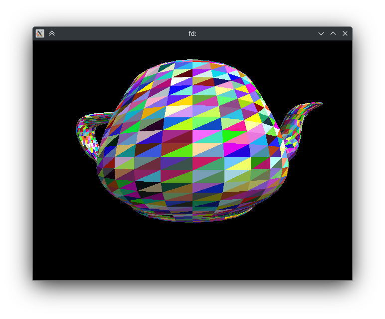
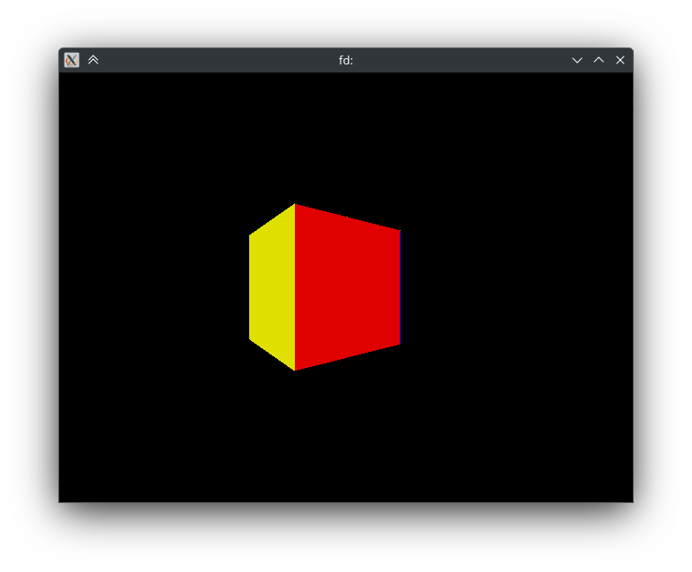

# _3dr_ 3D engine

# Build
```shell
cmake -DCMAKE_BUILD_TYPE=Release -S . -B _build/ &&
cmake --build _build/
```
# Run
1. Install `ffmpeg` for better viewing of rendered scenes.
1. Unpack samples:  
   ```shell 
   tar -xvf samples.tar.gz
   ```    
1. Render static scene with data imported from Wavefront OBJ:  
   ```shell 
   _build/3dr-convert samples/1.obj | _build/3dr | ffplay -i -
   ```
   
1. Render dynamic scene:
   ```shell 
   _build/3dr -s samples/scene.json -c samples/camera.jsons | ffplay -framerate 60 -i -
   ```
   
1. Render real-time with capture of keyboard input:
   ```shell 
   _build/3dr-ccapture /dev/input/event4 | _build/3dr -s samples/scene.json -c /dev/stdin | ffplay -framerate 60 -i -
   ```